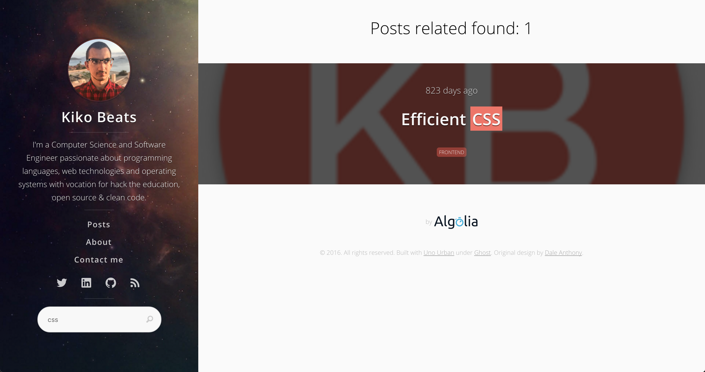
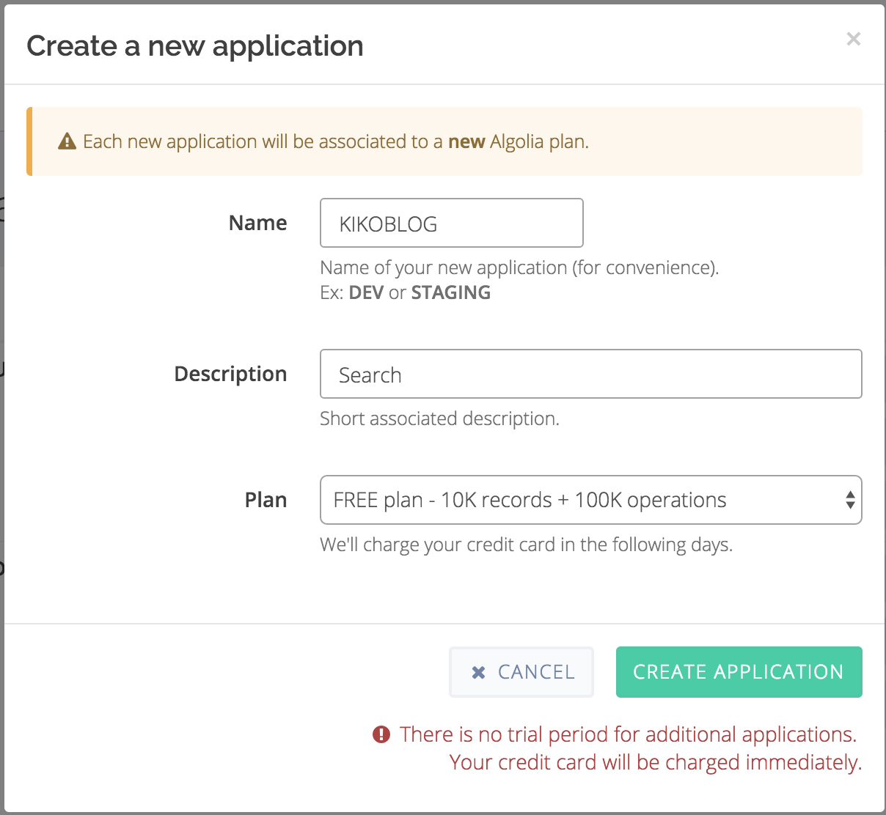

# Search Engine



Currently search engine is powered by [Algolia](https://www.algolia.com/).

Because it depends of the blog content and the content is different per each blog installation, you need to setup it following the next steps.

## Creating the blog index

[Algolia](https://www.algolia.com/) is a full text search engine. It offers a free plan, so we going to use it for create a intelligent index search of our content.

For do it, [first need to create an account](https://www.algolia.com/users/sign_up).

Using the account created, now we have to create an application domain:



Next step is create an index in the application domain.

> Click in the lateral menu into **Indices** and **New Index**

After that, we need to create a token with enough permissions or use Admin API Key.

> Click in the lateral menu into **API Keys** and **New API Key**

Now we have all the information to be possible connect with your index. This information are:

- APP_NAME
- APP_ID
- APP_KEY
- INDEX_NAME

We are going to use it for connect with your blog content.

## Connecting with your blog content

### Backend

We need to connect with algolia service and send our blog data.

First, Rename and edit `search.example.json` into `search.json`.

As you can see in this file, you need to setup your algolia connection using the variables reported by Algolia. Also you need to put special attention in two things.

#### Specifing Sitemaps

It specifies where is the content of your blog.

It's recommended specify the follow URL's:

```json
"sitemaps": [
  {"url": "https://YOUR_DOMAIN/sitemap-posts.xml"},
  {"url": "https://YOUR_DOMAIN/sitemap-pages.xml"}
],
```

#### Setup default values

We are going to index a set of attributes per each post.

If not possible to determinate a value for one attribute, we can specify a default values.

It's recommended to setup the follow default values:

```
"defaults": {
  "image": "https://YOUR_DOMAIN/assets/img/android-chrome-192x192.png",
  "category": "uncategorized"
}
```

Also be sure to review favicon customization first.

#### Run the index process

Exec `gulp build-search` and the task will index your content.

## Frontend

The last step that we need to do is connect the frontend client to access to your backend index.

Go to `Admin Panel` → `Code Injection` → `Blog Header`:

```js
var algolia_app_id = 'APP_ID'
var algolia_api_key = 'APP_KEY'
var algolia_index = 'INDEX_NAME'
```
